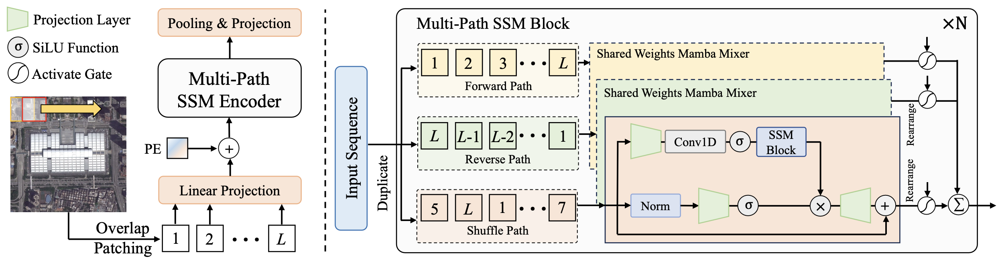

<div align="center">
    <h2>
        RSMamba: Remote Sensing Image Classification with State Space Model
    </h2>
</div>
<br>

<div align="center">
  
</div>
<br>
<div align="center">
  <a href="https://kychen.me/RSMamba">
    <span style="font-size: 20px; ">Project Page</span>
  </a>
  &nbsp;&nbsp;&nbsp;&nbsp;
  <a href="https://arxiv.org/abs/2403.19654">
    <span style="font-size: 20px; ">arXiv</span>
  </a>
  &nbsp;&nbsp;&nbsp;&nbsp;
  <a href="resources/RSMamba.pdf">
    <span style="font-size: 20px; ">PDF</span>
  </a>
  &nbsp;&nbsp;&nbsp;&nbsp;
  <a href="https://huggingface.co/spaces/KyanChen/RSMamba">
    <span style="font-size: 20px; ">HFSpace</span>
  </a>
</div>
<br>
<br>

[](https://github.com/KyanChen/RSMamba)
[](LICENSE)
[](https://arxiv.org/abs/2403.19654)
[](https://huggingface.co/spaces/KyanChen/RSMamba)

<br>
<br>

<div align="center">

English | [简体中文](README_zh-CN.md)

</div>


## Introduction

This repository is the code implementation of the paper [RSMamba: Remote Sensing Image Classification with State Space Model](https://arxiv.org/abs/2403.19654), which is based on the [MMPretrain](https://github.com/open-mmlab/mmpretrain) project.

The current branch has been tested on PyTorch 2.x and CUDA 12.1, supports Python 3.8+, and is compatible with most CUDA versions.

If you find this project helpful, please give us a star ⭐️, your support is our greatest motivation.

<details open>
<summary>Main Features</summary>

- Consistent API interface and usage with MMPretrain
- Open-sourced RSMamba models of different sizes in the paper
- Support for training and testing on multiple datasets

</details>

## Updates

🌟 **2024.03.28** Released the RSMamba project, which is fully consistent with the API interface and usage of MMPretrain.

🌟 **2024.03.29** Open-sourced the [weight files](https://huggingface.co/KyanChen/RSMamba/tree/main) of RSMamba models of different sizes in the paper.

## TODO

- [X] Open-source model training parameters

## Table of Contents

- [Introduction](#Introduction)
- [Updates](#Updates)
- [TODO](#TODO)
- [Table of Contents](#Table-of-Contents)
- [Installation](#Installation)
- [Dataset Preparation](#Dataset-Preparation)
- [Model Training](#Model-Training)
- [Model Testing](#Model-Testing)
- [Image Prediction](#Image-Prediction)
- [FAQ](#FAQ)
- [Acknowledgements](#Acknowledgements)
- [Citation](#Citation)
- [License](#License)
- [Contact Us](#Contact-Us)

## Installation

### Requirements

- Linux or Windows
- Python 3.8+, recommended 3.11
- PyTorch 2.0 or higher, recommended 2.2
- CUDA 11.7 or higher, recommended 12.1
- MMCV 2.0 or higher, recommended 2.1

### Environment Installation

It is recommended to use Miniconda for installation. The following commands will create a virtual environment named `rsmamba` and install PyTorch and MMCV. In the following installation steps, the default installed CUDA version is **12.1**. If your CUDA version is not 12.1, please modify it according to the actual situation.

Note: If you are experienced with PyTorch and have already installed it, you can skip to the next section. Otherwise, you can follow the steps below.

<details open>

**Step 0**: Install [Miniconda](https://docs.conda.io/projects/miniconda/en/latest/index.html).

**Step 1**: Create a virtual environment named `rsmamba` and activate it.

```shell
conda create -n rsmamba python=3.11 -y
conda activate rsmamba
```

**Step 2**: Install [PyTorch2.2.x](https://pytorch.org/get-started/locally/).

Linux/Windows:
```shell
pip install torch==2.1.2 torchvision==0.16.2 torchaudio==2.1.2 --index-url https://download.pytorch.org/whl/cu121 -y
```
Or
```shell
conda install pytorch==2.1.2 torchvision==0.16.2 torchaudio==2.1.2 pytorch-cuda=12.1 -c pytorch -c nvidia -y
```

**Step 3**: Install [MMCV2.1.x](https://mmcv.readthedocs.io/en/latest/get_started/installation.html).

```shell
pip install -U openmim
mim install mmcv==2.1.0
# or
pip install mmcv==2.1.0 -f https://download.openmmlab.com/mmcv/dist/cu121/torch2.1/index.html
```

**Step 4**: Install other dependencies.

```shell
pip install -U mat4py ipdb
pip install transformers==4.39.2
pip install causal-conv1d==1.2.0.post2
pip install mamba-ssm==1.2.0.post1
```

</details>


### Install RSMamba


You can download or clone the RSMamba repository.

```shell
git clone git@github.com:KyanChen/RSMamba.git
cd RSMamba
```

## Dataset Preparation

<details open>

### Remote Sensing Image Classification Dataset

We provide the method of preparing the remote sensing image classification dataset used in the paper.

#### UC Merced Dataset

- Image and annotation download link: [UC Merced Dataset](http://weegee.vision.ucmerced.edu/datasets/landuse.html).


#### AID Dataset

- Image and annotation download link: [AID Dataset](https://www.kaggle.com/datasets/jiayuanchengala/aid-scene-classification-datasets)。


#### NWPU RESISC45 Dataset

- Image and annotation download link: [NWPU RESISC45 Dataset](https://aistudio.baidu.com/datasetdetail/220767)。


**Note**: The `data` folder of this project provides a small number of image annotation examples for the above datasets.

#### Organization Method

You can also choose other sources to download the data, but you need to organize the dataset in the following format：

```
${DATASET_ROOT} # Dataset root directory, for example: /home/username/data/UC
├── airplane
│   ├── airplane01.tif
│   ├── airplane02.tif
│   └── ...
├── ...
├── ...
├── ...
└── ...
```
Note: In the project folder `datainfo`, we provide the data set partition file. You can also use the [Python script](tools/rsmamba/split_trainval.py) to divide the data set.

### Other Datasets

If you want to use other datasets, you can refer to the [MMPretrain documentation](https://mmpretrain.readthedocs.io/en/latest/user_guides/dataset_prepare.html) for dataset preparation.

</details>

## Model Training

### RSMamba Model

#### Config File and Main Parameter Parsing

We provide the configuration files of RSMamba models with different parameter sizes in the paper, which can be found in the [configuration files](configs/rsmamba) folder. The Config file is fully consistent with the API interface and usage of MMPretrain. Below we provide an analysis of some of the main parameters. If you want to know more about the parameters, you can refer to the [MMPretrain documentation](https://mmpretrain.readthedocs.io/en/latest/user_guides/config.html).

<details>

**Parameter Parsing**：

- `work_dir`：The output path of the model training, generally no need to modify.
- `code_root`：The root directory of the code, **modify to the absolute path of the root directory of this project**.
- `data_root`：The root directory of the dataset, **modify to the absolute path of the dataset root directory**.
- `batch_size`：The batch size of a single card, **needs to be modified according to the memory size**.
- `max_epochs`：The maximum number of training epochs, generally no need to modify.
- `vis_backends/WandbVisBackend`：Configuration of the network-side visualization tool, **after opening the comment, you need to register an account on the `wandb` official website, and you can view the visualization results during the training process in the web browser**.
- `model/backbone/arch`：The type of the model's backbone network, **needs to be modified according to the selected model**, including `b`, `l`, `h`.
- `model/backbone/path_type`：The path type of the model, **needs to be modified according to the selected model**.
- `default_hooks-CheckpointHook`：Configuration of the checkpoint saving during the model training process, generally no need to modify.
- `num_classes`：The number of categories in the dataset, **needs to be modified according to the number of categories in the dataset**.
- `dataset_type`：The type of the dataset, **needs to be modified according to the type of the dataset**.
- `resume`: Whether to resume training, generally no need to modify.
- `load_from`：The path of the pre-trained checkpoint of the model, generally no need to modify.
- `data_preprocessor/mean/std`：The mean and standard deviation of data preprocessing, **needs to be modified according to the mean and standard deviation of the dataset**, generally no need to modify, refer to [Python script](tools/rsmamba/get_dataset_img_meanstd.py).

Some parameters come from the inheritance value of `_base_`, you can find them in the [basic configuration files](configs/rsmamba/_base_/) folder.

</details>


#### Single Card Training

```shell
python tools/train.py configs/rsmamba/name_to_config.py  # name_to_config.py is the configuration file you want to use
```

#### Multi-card Training

```shell
sh ./tools/dist_train.sh configs/rsmamba/name_to_config.py ${GPU_NUM}  # name_to_config.py is the configuration file you want to use, GPU_NUM is the number of GPUs used
```

### Other Image Classification Models

<details open>

If you want to use other image classification models, you can refer to [MMPretrain](https://github.com/open-mmlab/mmpretrain) for model training, or you can put their Config files into the `configs` folder of this project, and then train them according to the above method.

</details>

## Model Testing

#### Single Card Testing：

```shell
python tools/test.py configs/rsmamba/name_to_config.py ${CHECKPOINT_FILE}  # name_to_config.py is the configuration file you want to use, CHECKPOINT_FILE is the checkpoint file you want to use
```

#### Multi-card Testing：

```shell
sh ./tools/dist_test.sh configs/rsmamba/name_to_config.py ${CHECKPOINT_FILE} ${GPU_NUM}  # name_to_config.py is the configuration file you want to use, CHECKPOINT_FILE is the checkpoint file you want to use, GPU_NUM is the number of GPUs used
```


## Image Prediction

#### Single Image Prediction：

```shell
python demo/image_demo.py ${IMAGE_FILE}  configs/rsmamba/name_to_config.py --checkpoint ${CHECKPOINT_FILE} --show-dir ${OUTPUT_DIR}  # IMAGE_FILE is the image file you want to predict, name_to_config.py is the configuration file you want to use, CHECKPOINT_FILE is the checkpoint file you want to use, OUTPUT_DIR is the output path of the prediction result
```

#### Multi-image Prediction：

```shell
python demo/image_demo.py ${IMAGE_DIR}  configs/rsmamba/name_to_config.py --checkpoint ${CHECKPOINT_FILE} --show-dir ${OUTPUT_DIR}  # IMAGE_DIR is the image folder you want to predict, name_to_config.py is the configuration file you want to use, CHECKPOINT_FILE is the checkpoint file you want to use, OUTPUT_DIR is the output path of the prediction result
```


## FAQ

<details open>

We have listed some common problems and their corresponding solutions here. If you find that some problems are missing, please feel free to submit a PR to enrich this list. If you cannot get help here, please use [issue](https://github.com/KyanChen/RSMamba/issues) to seek help. Please fill in all the required information in the template, which will help us locate the problem more quickly.

### 1. Do I need to install MMPretrain?

We recommend that you do not install MMPretrain, as we have made some modifications to the code of MMPretrain, and installing MMPretrain may cause the code to run incorrectly. If you encounter an error that the module has not been registered, please check:

- If MMPretrain is installed, uninstall it
- If `@MODELS.register_module()` is added in front of the class name, if not, add it
- If `from .xxx import xxx` is added in `__init__.py`, if not, add it
- If `custom_imports = dict(imports=['mmpretrain.rsmamba'], allow_failed_imports=False)` is added in the Config file, if not, add it


### 2. Solution to dist_train.sh: Bad substitution

If you encounter a `Bad substitution` error when running `dist_train.sh`, use `bash dist_train.sh` to run the script.

</details>

## Acknowledgements

This project is developed based on [MMPretrain](https://github.com/open-mmlab/mmpretrain), thanks to the MMPretrain project for providing the code foundation.

## Citation

If you use the code or performance benchmarks of this project in your research, please refer to the following bibtex citation of RSMamba.

```
@misc{chen2024rsmamba,
      title={RSMamba: Remote Sensing Image Classification with State Space Model}, 
      author={Keyan Chen and Bowen Chen and Chenyang Liu and Wenyuan Li and Zhengxia Zou and Zhenwei Shi},
      year={2024},
      eprint={2403.19654},
      archivePrefix={arXiv},
      primaryClass={cs.CV}
}
```

## License

This project is licensed under the [Apache 2.0 License](LICENSE).

## Contact Us

If you have any other questions❓, please contact us in time 👬
